# System Design

Below are the system design diagrams for Network Security / Intrusion Detection ML System.

---

### Figure 1
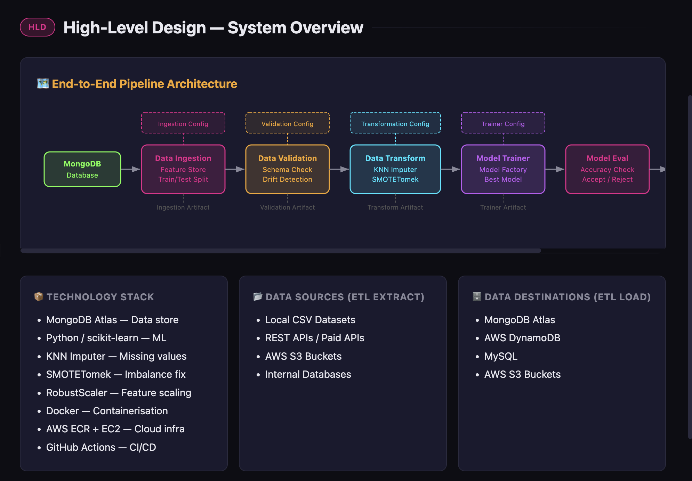

---

### Figure 2
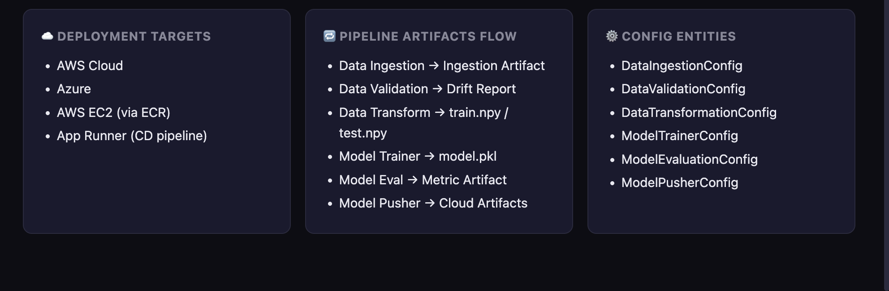

---

### Figure 3
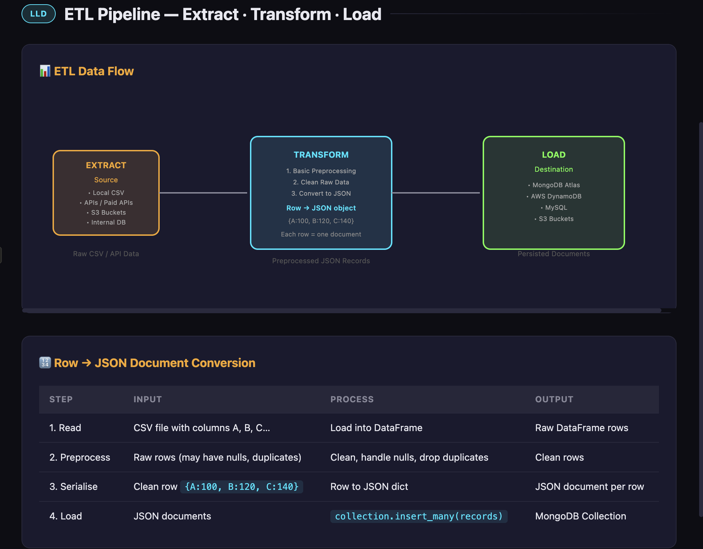

---

### Figure 4

---

### Figure 5
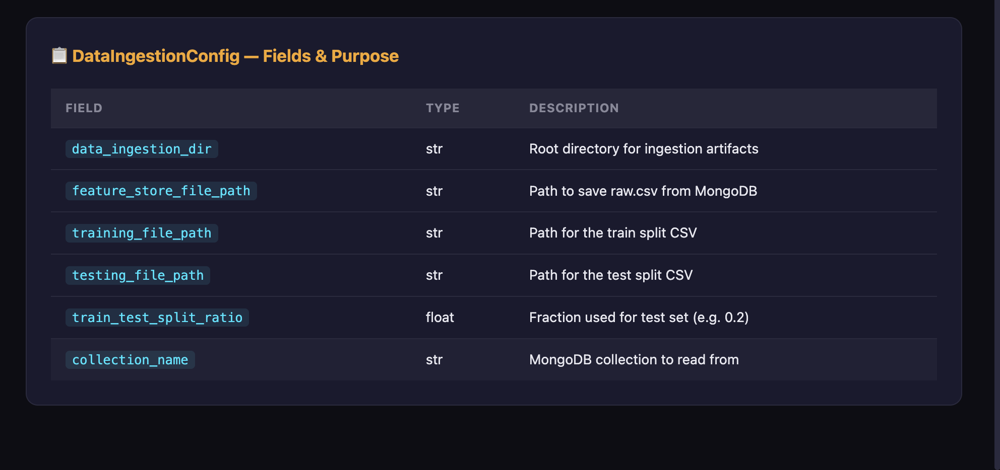

---

### Figure 6
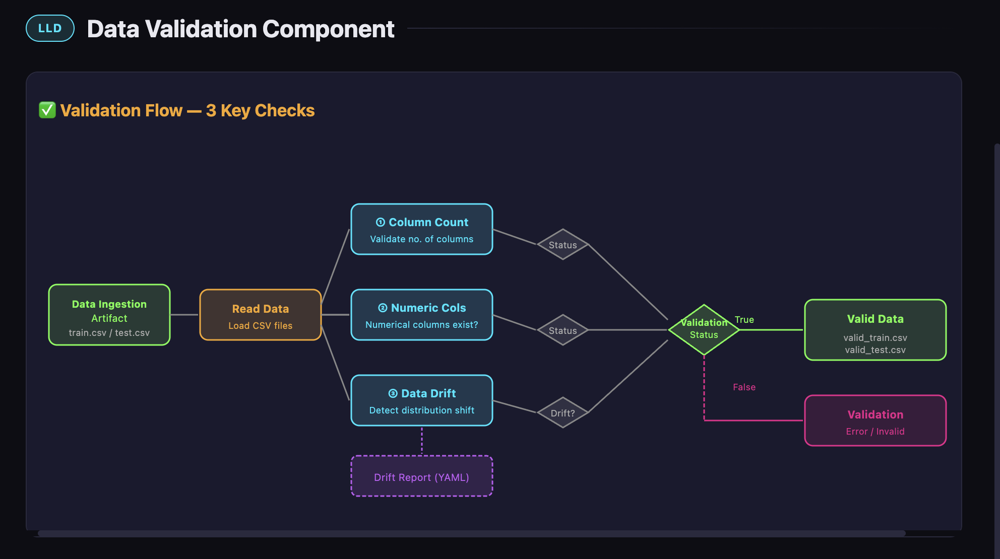

---

### Figure 7
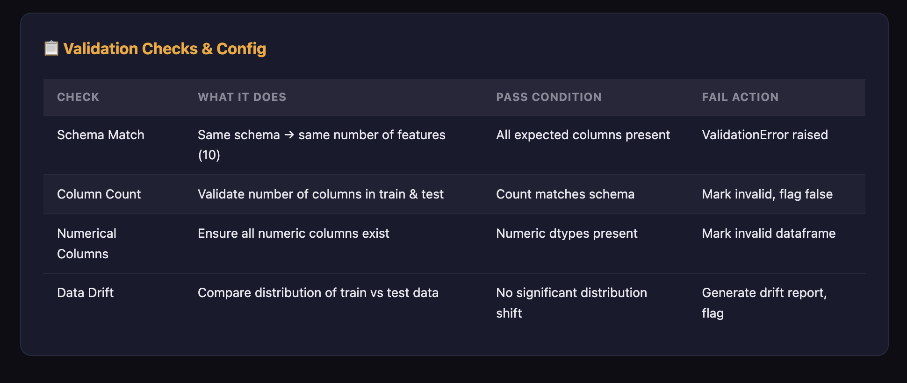

---

### Figure 8
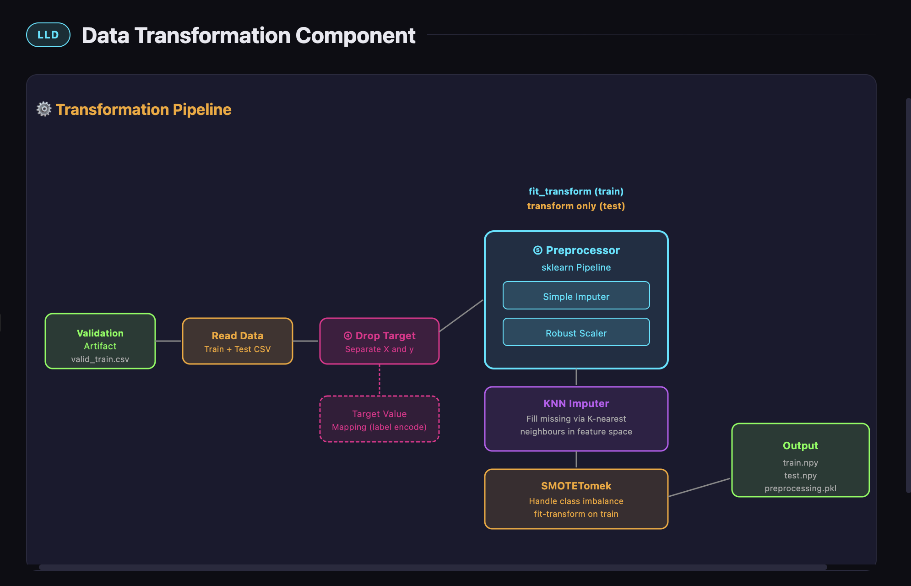

---

### Figure 9
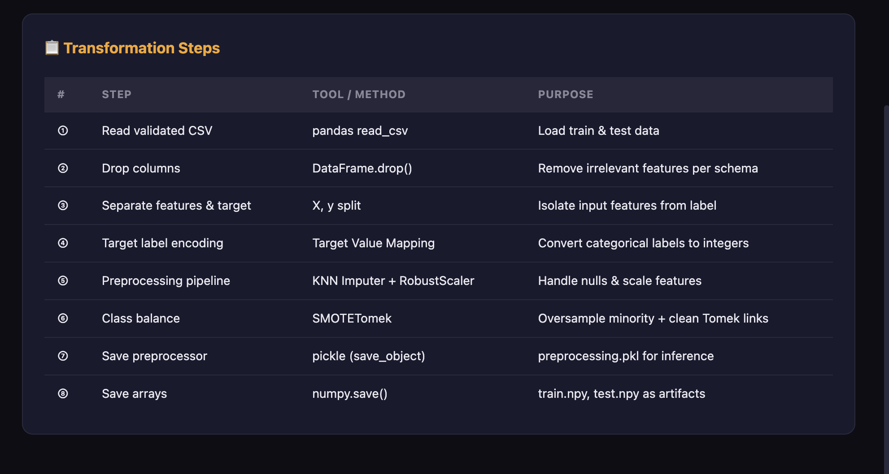

---

### Figure 10
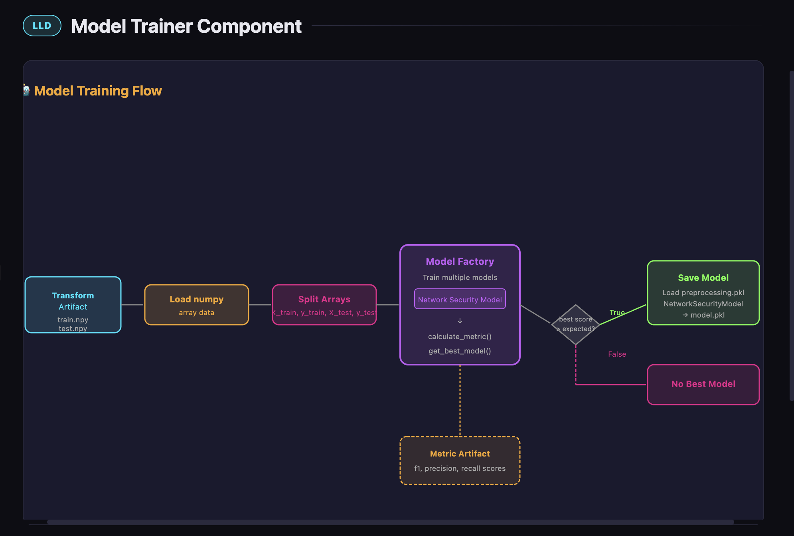

---

### Figure 11
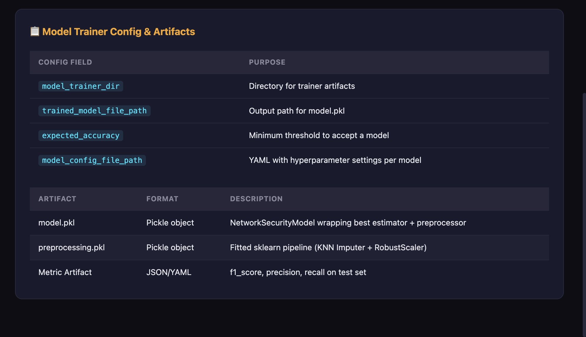

---

### Figure 12
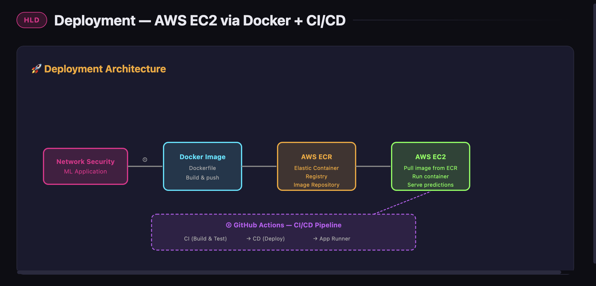

---

### Figure 13
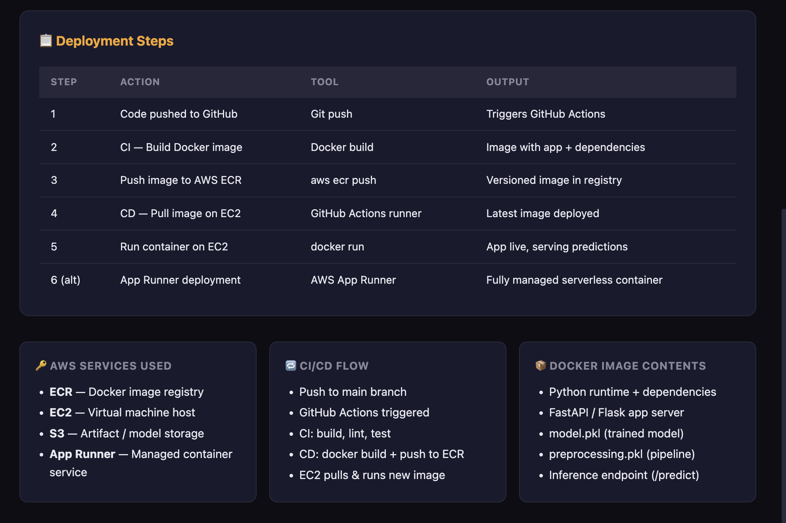
