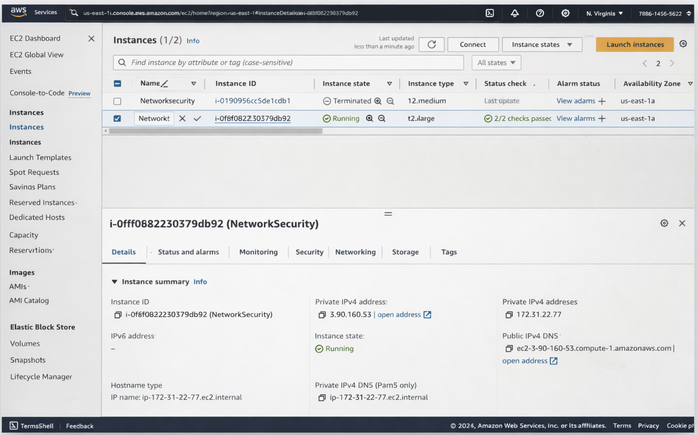
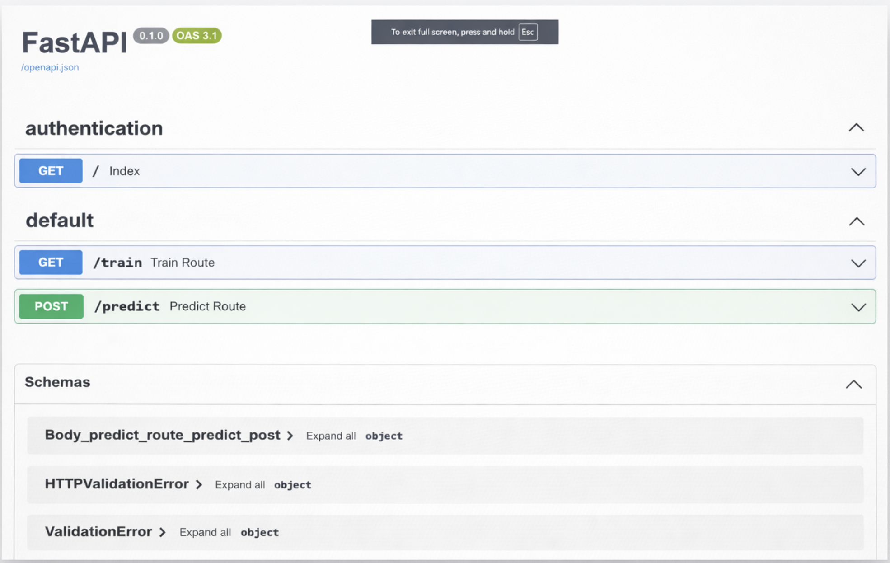
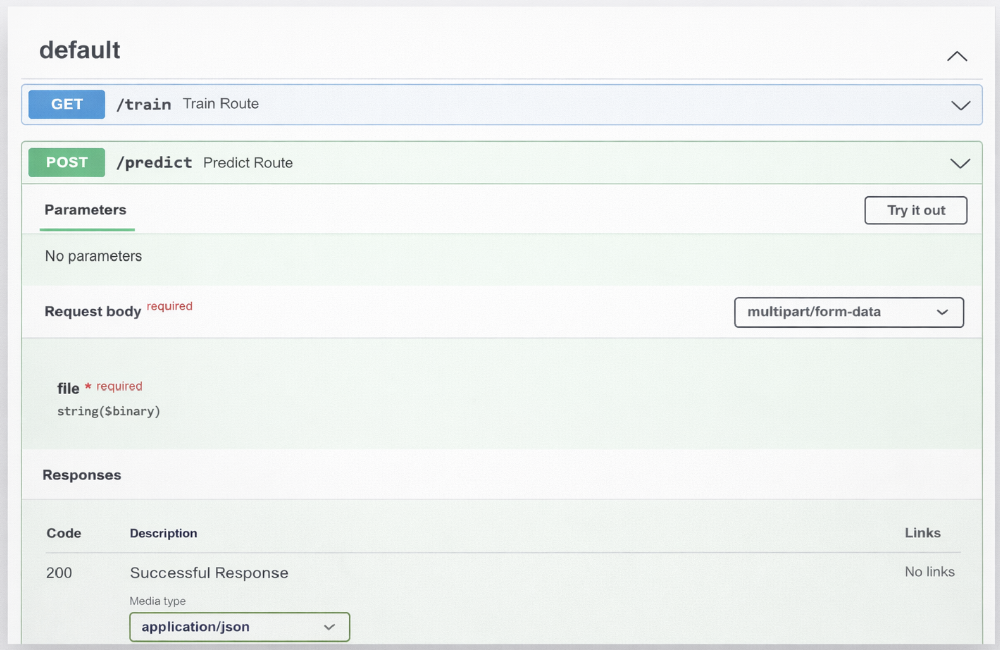
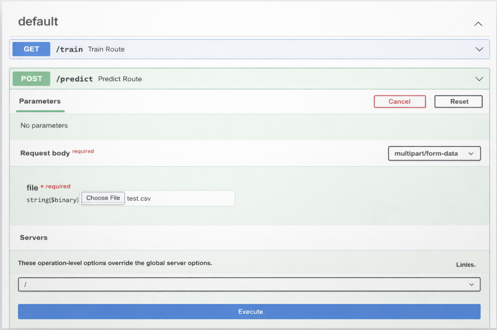
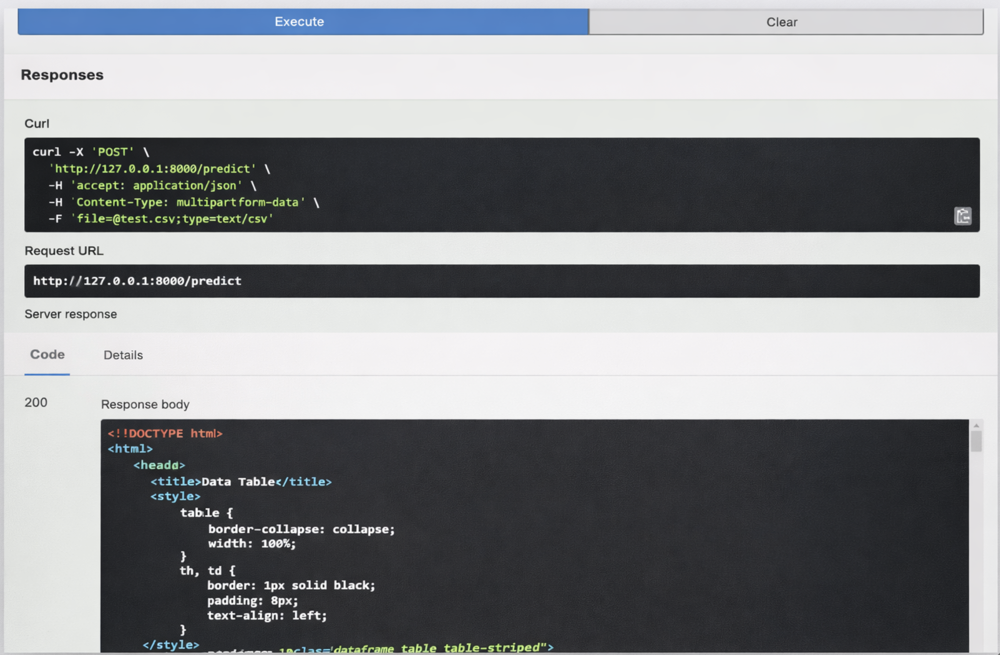
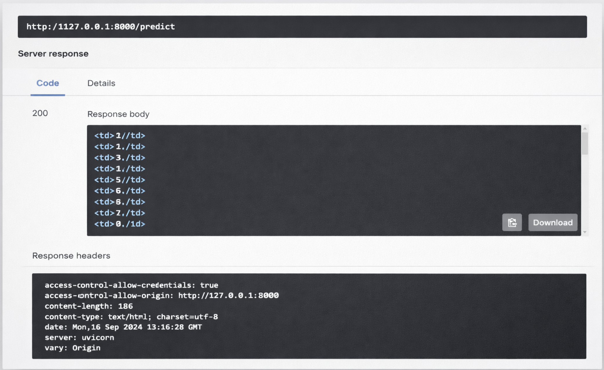

# Wireframe

Below are the wireframe screens with the title and description placed.

### Dashboard — Network Overview
Summary metrics, overall status, and quick access widgets.

### Network Topology Map
Visual representation of devices and connections.

### Live Alerts & Notifications
Active security alerts with severity indicators.

### Incident Details
Incident timeline, affected assets, and recommended actions.

### Vulnerability Scan Results
Scan summary, affected hosts, and remediation status.

### User & Access Management
Manage accounts, roles, and permissions.

### Reports & Audit Logs
Exportable logs, compliance reports, and filters.

